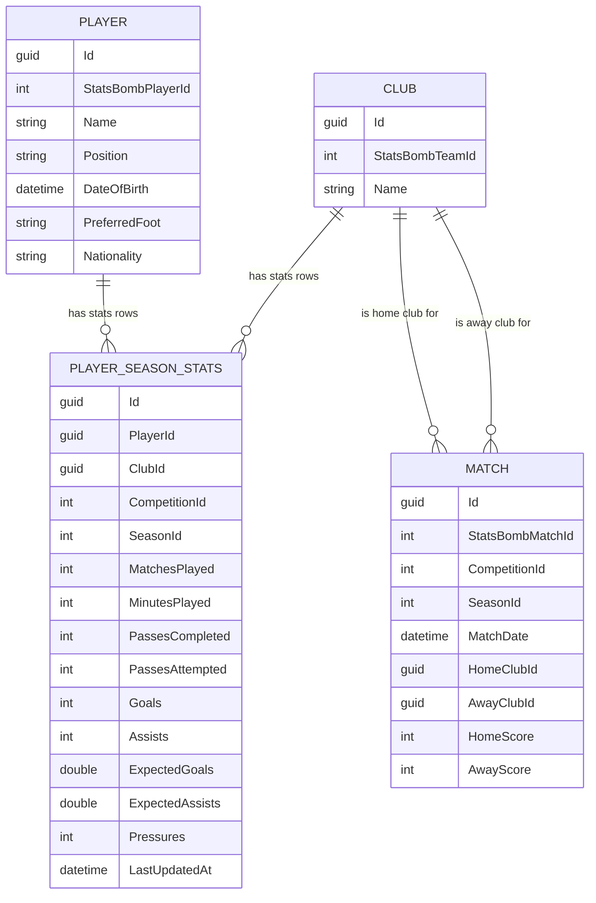

# Domain Model — Task 1.4

Core entities for FootballIQ Scout: `Club`, `Player`, `PlayerSeasonStats`, `Match`.

## Entities

### Club
A football club, identified by its StatsBomb team ID.

| Field | Type | Notes |
|---|---|---|
| `Id` | `Guid` | Primary key |
| `StatsBombTeamId` | `int` | Unique. External reference used during ingestion (Layer 2) to avoid creating duplicate clubs when re-ingesting matches |
| `Name` | `string` | |

### Player
A football player, identified by their StatsBomb player ID.

| Field | Type | Notes |
|---|---|---|
| `Id` | `Guid` | Primary key |
| `StatsBombPlayerId` | `int` | Unique. Same idempotency purpose as `Club.StatsBombTeamId` |
| `Name` | `string` | |
| `Position` | `Position` enum | Primary on-field position. Stored as text in the database (see Design Decisions) |
| `DateOfBirth` | `DateTime?` | Nullable — see StatsBomb data-availability caveat below |
| `PreferredFoot` | `Foot?` enum | Nullable — see caveat below |
| `Nationality` | `string?` | Nullable |

### PlayerSeasonStats
A player's aggregated statistics for one club, competition, and season.

| Field | Type | Notes |
|---|---|---|
| `Id` | `Guid` | Primary key |
| `PlayerId` | `Guid` | FK → `Player` |
| `ClubId` | `Guid` | FK → `Club` |
| `CompetitionId`, `SeasonId` | `int` | Identifies which StatsBomb season this row covers |
| `MatchesPlayed`, `MinutesPlayed` | `int` | |
| `PassesCompleted`, `PassesAttempted` | `int` | Pass accuracy is computed from these, not stored pre-calculated |
| `Goals`, `Assists` | `int` | |
| `ExpectedGoals`, `ExpectedAssists` | `double` | xG / xA |
| `Pressures` | `int` | Used for "pressing intensity" queries |
| `LastUpdatedAt` | `DateTime` | When ingestion last recalculated this row |

**Why this is its own table, not columns on `Player`:** a player can play for multiple clubs across multiple seasons. Modeling stats as a one-to-many relationship (one player → many season-stat rows) gives us both club history and season-by-season progression "for free" — e.g. `player.SeasonStats.Select(s => s.Club)` for clubs played for, `player.SeasonStats.OrderBy(s => s.SeasonId)` for progression over time.

### Match
A single football match between two clubs, identified by its StatsBomb match ID.

| Field | Type | Notes |
|---|---|---|
| `Id` | `Guid` | Primary key |
| `StatsBombMatchId` | `int` | Unique. Idempotency key for ingestion |
| `CompetitionId`, `SeasonId` | `int` | |
| `MatchDate` | `DateTime` | |
| `HomeClubId`, `AwayClubId` | `Guid` | FK → `Club` (two separate FKs to the same table, no inverse navigation) |
| `HomeScore`, `AwayScore` | `int` | |

---

## StatsBomb data-availability caveat

`Player.DateOfBirth` and `Player.PreferredFoot` are nullable **on purpose**. StatsBomb's open-data lineup/player JSON does not include date of birth or footedness — only name, nationality, jersey number, and positions played. These columns will remain `null` after Layer 2 ingestion until a future enrichment source is added (e.g. a small manually curated dataset for notable players).

This is a deliberate "model the field now, populate it later" decision, not a bug. Don't be surprised when these columns are empty after ingestion.

---

## Relationships

- **`Player` 1 → many `PlayerSeasonStats`** (`Player.SeasonStats`), `OnDelete: Cascade` — deleting a player deletes their stats rows.
- **`Club` 1 → many `PlayerSeasonStats`** (`Club.SeasonStats`), `OnDelete: Cascade` — deleting a club deletes its players' stats rows for that club.
- **`Match` → `Club`, twice** (`HomeClubId`, `AwayClubId`), no inverse navigation, `OnDelete: Restrict` — a club can't be deleted while matches reference it; matches are historical records.

---

## Design decisions

1. **EF configuration via `IEntityTypeConfiguration<T>`** — one configuration class per entity in `Infrastructure/Persistence/Configurations/`, wired via `modelBuilder.ApplyConfigurationsFromAssembly(...)`. Keeps `OnModelCreating` minimal and scales cleanly as entities are added.
2. **Enums stored as strings** (`Position`, `Foot` via `.HasConversion<string>()`) — readable when inspecting the database directly (`"LeftBack"` instead of `2`), negligible cost at this scale.
3. **Enums live in `Domain/Enums/`, not `Domain/ValueObjects/`** — a plain enum has no behavior/validation, so `Enums/` is more honest. `ValueObjects/` stays reserved for a future type like `Season` if it gains real validation logic. (Small deviation from the original CLAUDE.md folder sketch.)
4. **Unique indexes on `StatsBombTeamId`, `StatsBombPlayerId`, `StatsBombMatchId`** — these are the idempotent-ingestion keys for Layer 2 (re-running ingestion shouldn't create duplicates).
5. **Tables are snake_case via `ToTable(...)`** (`clubs`, `players`, `player_season_stats`, `matches`) — satisfies CLAUDE.md's stated convention with zero new packages.
6. **Columns remain PascalCase** (EF Core default) — `EFCore.NamingConventions` would give snake_case columns too, but that's a new-package decision, deferred (see Open Items).
7. **Delete behaviors**: `PlayerSeasonStats` → `Player`/`Club` = `Cascade` (stats are meaningless without their player/club); `Match` → `Club` (both FKs) = `Restrict` (don't silently erase match history if a club is deleted).

---

## Open items / future considerations

- **Composite uniqueness on `PlayerSeasonStats`** (`PlayerId` + `ClubId` + `CompetitionId` + `SeasonId`) — not enforced yet. Revisit in Layer 2 when ingestion idempotency for stats rows is implemented.
- **Snake_case columns** via `EFCore.NamingConventions` — currently deferred; columns are PascalCase. Revisit if desired, but requires adding a new package and would rename every column in a follow-up migration.
- **`DateOfBirth` / `PreferredFoot` enrichment — tracked as Task 2.8.** Currently always `null` after ingestion (StatsBomb doesn't provide them). Age is one of the most important scouting signals, so this is **not optional long-term** — a data source must be chosen during Layer 2. Candidates discussed: Wikidata SPARQL lookup by player name (free, no API key, good coverage for pro footballers, but fuzzy name matching), football-data.org squads (already in the stack, but historical coverage for 2020/21 players may be patchy), or a curated open dataset joined by name. Decision deferred to when Layer 2 ingestion is actually being built.
