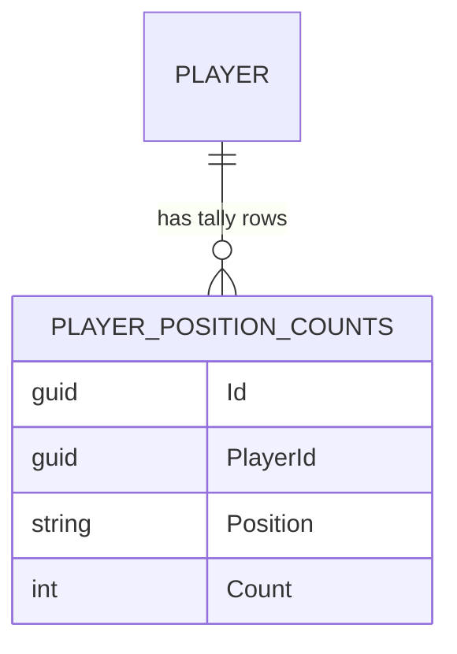
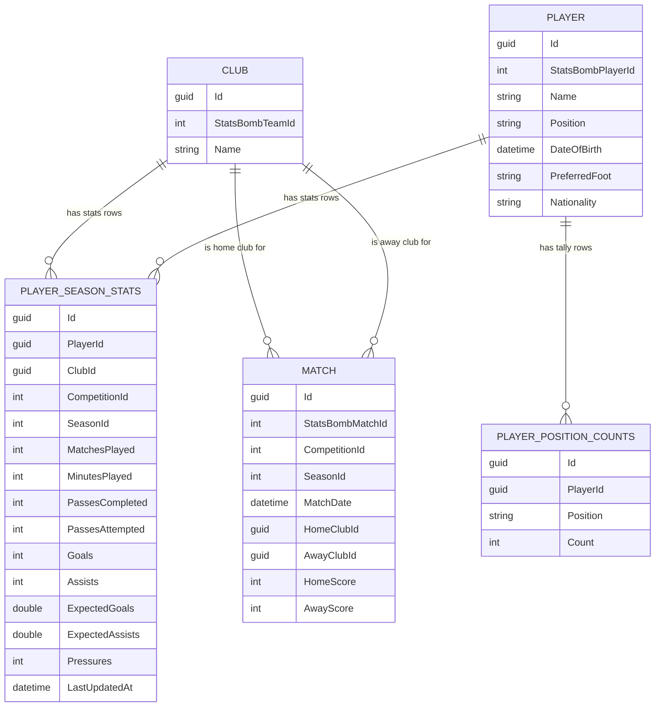

# Domain Model — Task 1.4

Core entities for FootballIQ Scout: `Club`, `Player`, `PlayerSeasonStats`, `Match`. Two supporting entities added later in Layer 2 — `IngestionLog` and `PlayerPositionTally` — are documented in their own sections below.

## Entities

### Club
A football club, identified by its StatsBomb team ID.

| Field | Type | Notes |
|---|---|---|
| `Id` | `Guid` | Primary key |
| `StatsBombTeamId` | `int` | Unique. External reference used during ingestion (Layer 2) to avoid creating duplicate clubs when re-ingesting matches |
| `Name` | `string` | |

### Player
A football player, identified by their StatsBomb player ID.

| Field | Type | Notes |
|---|---|---|
| `Id` | `Guid` | Primary key |
| `StatsBombPlayerId` | `int` | Unique. Same idempotency purpose as `Club.StatsBombTeamId` |
| `Name` | `string` | |
| `Position` | `Position` enum | Primary on-field position. Stored as text in the database (see Design Decisions) |
| `DateOfBirth` | `DateTime?` | Nullable — see StatsBomb data-availability caveat below |
| `PreferredFoot` | `Foot?` enum | Nullable — see caveat below |
| `Nationality` | `string?` | Nullable |

### PlayerSeasonStats
A player's aggregated statistics for one club, competition, and season.

| Field | Type | Notes |
|---|---|---|
| `Id` | `Guid` | Primary key |
| `PlayerId` | `Guid` | FK → `Player` |
| `ClubId` | `Guid` | FK → `Club` |
| `CompetitionId`, `SeasonId` | `int` | Identifies which StatsBomb season this row covers |
| `MatchesPlayed`, `MinutesPlayed` | `int` | |
| `PassesCompleted`, `PassesAttempted` | `int` | Pass accuracy is computed from these, not stored pre-calculated |
| `Goals`, `Assists` | `int` | |
| `ExpectedGoals`, `ExpectedAssists` | `double` | xG / xA |
| `Pressures` | `int` | Used for "pressing intensity" queries |
| `LastUpdatedAt` | `DateTime` | When ingestion last recalculated this row |

**Why this is its own table, not columns on `Player`:** a player can play for multiple clubs across multiple seasons. Modeling stats as a one-to-many relationship (one player → many season-stat rows) gives us both club history and season-by-season progression "for free" — e.g. `player.SeasonStats.Select(s => s.Club)` for clubs played for, `player.SeasonStats.OrderBy(s => s.SeasonId)` for progression over time.

**How `Goals`, `Assists`, `ExpectedGoals`, `ExpectedAssists` are actually computed** (in `PlayerStatsAggregator`, from raw StatsBomb event data — none of these are StatsBomb fields directly):
- **`Goals`**: count of events where `Type.Name == "Shot"` and `Shot.Outcome.Name == "Goal"`.
- **`Assists`**: count of `Pass` events where `Pass.ShotAssist == true`, `Pass.AssistedShotId` is set, **and** that referenced shot's outcome was a goal. (A "shot-assisting pass" that led to a saved or missed shot is not an assist.)
- **`ExpectedGoals` (xG)**: sum of `Shot.StatsbombXg` across all of the player's shot events — StatsBomb's own model output, just accumulated per player.
- **`ExpectedAssists` (xA)**: sum of `Shot.StatsbombXg` for every shot that was preceded by one of the player's `ShotAssist` passes — i.e. "how much xG did my key passes generate," independent of whether the shot actually scored.

This is why `Assists` and `ExpectedAssists` can diverge for a player: `Assists` only counts passes whose shot **became a goal**; `ExpectedAssists` rewards good chance creation even when the shot was missed.

### Match
A single football match between two clubs, identified by its StatsBomb match ID.

| Field | Type | Notes |
|---|---|---|
| `Id` | `Guid` | Primary key |
| `StatsBombMatchId` | `int` | Unique. Idempotency key for ingestion |
| `CompetitionId`, `SeasonId` | `int` | |
| `MatchDate` | `DateTime` | |
| `HomeClubId`, `AwayClubId` | `Guid` | FK → `Club` (two separate FKs to the same table, no inverse navigation) |
| `HomeScore`, `AwayScore` | `int` | |

---

## IngestionLog (Task 2.5)

The idempotency ledger for StatsBomb ingestion — one row per match that has been fully ingested.

| Field | Type | Notes |
|---|---|---|
| `Id` | `Guid` | Primary key |
| `StatsBombMatchId` | `int` | Unique. The match this row marks as done |
| `IngestedAt` | `DateTime` | When ingestion completed for this match |

**Table name:** `ingestion_log`. **Why it exists:** `IngestSeasonAsync` checks this table (preloaded into a `HashSet<int>` once per season — see the N+1 fix in Layer 2 code review) to skip matches that were already ingested, so re-running ingestion for a season that's partly or fully done is a no-op for those matches rather than creating duplicate `PlayerSeasonStats` rows. A row is only inserted after a match's events, lineups, and stat aggregation all succeed — so a crash mid-match leaves no partial `IngestionLog` row, and that match is correctly retried on the next run.

---

## Player demographic enrichment (Task 2.8)

`Player.DateOfBirth` and `Player.PreferredFoot` are nullable because StatsBomb's open-data lineup/player JSON doesn't include either field — only name, nationality, jersey number, and positions played. After StatsBomb ingestion alone, both columns are always `null`.

**`DateOfBirth` is filled in by a separate enrichment step, run after ingestion, using Wikidata.** `PreferredFoot` stays `null` — Wikidata's footedness coverage is too sparse to be worth the same effort, and it's a lower-priority scouting signal than age.

**Why Wikidata:** free, no API key, and strong coverage for professional footballers — unlike football-data.org (no squad/player endpoint exists in this codebase) or a hand-curated dataset (doesn't scale past a handful of notable players).

**The ambiguity problem and how it's solved:** many players share a name (there are multiple "David Silva"s in football history). Matching by name alone risks silently assigning the wrong birth date. The fix: match by **name + known club** together, but only when there's more than one candidate to disambiguate. Every ingested player already has a club via `PlayerSeasonStats → Club`, so this disambiguator is free — no new data needed.

- **Exactly one Wikidata candidate for the name → trust it outright**, even if its recorded club history doesn't mention the player's known club. Wikidata's club data is frequently stale (a loan or transfer the page was never updated for), and StatsBomb's full legal names make a same-name collision rare — so requiring a club match here mostly produced false negatives, not protection against false positives. A real-data sample of 15 unmatched players found 11/15 were exactly this case (e.g. Kenedy's Wikidata page never recorded his loan move to Granada).
- **Multiple candidates → club match required.** With more than one same-named candidate, the known club is the only disambiguator available, so a name match is only accepted if exactly one candidate's club history matches; zero or multiple matches means skip rather than guess.
- Club name comparison is **token-based, not substring-based** — e.g. our DB's `"Celta Vigo"` matches Wikidata's `"RC Celta de Vigo"` because every word in the first appears in the second, regardless of extra words in between.

**Lookup mechanism:** a two-step process, because SPARQL (Wikidata's query language) can't reliably fuzzy-match name strings, only exact entity IDs:
1. **Fuzzy name search** — one `wbsearchentities` API call per player name, returning a handful of candidate entity IDs (QIDs).
2. **Batched fact lookup** — one SPARQL query per batch of players, listing every candidate QID collected in that batch via a `VALUES` clause, fetching birth date (`P569`) and club history (`P54`) for all of them at once. This is the expensive part to avoid repeating per-player.

**Idempotent by construction:** enrichment only ever targets players where `DateOfBirth IS NULL`. No ledger table is needed (unlike `IngestionLog` for StatsBomb ingestion) — running it twice is naturally a no-op for already-enriched players.

**Trigger:** a separate step from StatsBomb ingestion, not automatic — `POST /api/admin/enrich-players` queues a background job (same `Channel`-backed pattern as `/api/admin/ingest`).

---

## Player position assignment (bug fix, post-Layer-2)

`Player.Position` was originally never set during ingestion — `GetOrCreatePlayerAsync` just left it at the C# default for the enum, which is its first declared member, `Goalkeeper` (`= 0`). The result: every ingested player silently showed up as a `Goalkeeper` regardless of their actual role. This went unnoticed until manually inspecting the database.

**The fix:** StatsBomb's lineup JSON already includes a `positions` array per player (e.g. `"Right Center Back"`, `"Center Forward"`), with one entry per position the player occupied during that match. `StatsBombPositionMapper` translates each of StatsBomb's 25 granular labels down to our 7-value `Position` enum (e.g. `"Right Center Back"` and `"Left Center Back"` both map to `CentreBack`).

**A player can be listed at more than one position** — across different matches, or even within one match if subbed into a different role. Since `Player.Position` holds a single value, we need a rule: **whichever mapped position occurs most often across all of a player's lineup appearances wins.** This is tracked via a new entity, `PlayerPositionTally` (table `player_position_counts`, columns `PlayerId`, `Position`, `Count`, with a composite unique index on `PlayerId`+`Position`) — every time a match is ingested, each player's position entries for that match are mapped and added to their running counts, and `Player.Position` is recomputed as whichever bucket currently has the highest count.

**Why a separate table instead of recomputing from raw files each time:** matches already in `IngestionLog` are skipped entirely on re-ingestion (including their lineup data) — there's no other durable place to accumulate a count across matches without re-reading already-ingested files.

---

## Relationships

- **`Player` 1 → many `PlayerSeasonStats`** (`Player.SeasonStats`), `OnDelete: Cascade` — deleting a player deletes their stats rows.
- **`Club` 1 → many `PlayerSeasonStats`** (`Club.SeasonStats`), `OnDelete: Cascade` — deleting a club deletes its players' stats rows for that club.
- **`Match` → `Club`, twice** (`HomeClubId`, `AwayClubId`), no inverse navigation, `OnDelete: Restrict` — a club can't be deleted while matches reference it; matches are historical records.
- **`Player` 1 → many `PlayerPositionTally`** — running per-position counts used to compute `Player.Position` (see above). No cascade-delete note needed beyond the standard FK-to-`Player` cascade.
- **`IngestionLog` has no FK to any other table** — it's a standalone ledger keyed only by `StatsBombMatchId`, not tied to `Match` (a match could fail aggregation after its row is created, or `Match` rows could be re-derived independently — keeping these decoupled avoids that edge case).

`IngestionLog` is omitted from this diagram since it has no FK relationships to diagram — see its own section above for its three columns.

---

## Design decisions

1. **EF configuration via `IEntityTypeConfiguration<T>`** — one configuration class per entity in `Infrastructure/Persistence/Configurations/`, wired via `modelBuilder.ApplyConfigurationsFromAssembly(...)`. Keeps `OnModelCreating` minimal and scales cleanly as entities are added.
2. **Enums stored as strings** (`Position`, `Foot` via `.HasConversion<string>()`) — readable when inspecting the database directly (`"LeftBack"` instead of `2`), negligible cost at this scale.
3. **Enums live in `Domain/Enums/`, not `Domain/ValueObjects/`** — a plain enum has no behavior/validation, so `Enums/` is more honest. `ValueObjects/` stays reserved for a future type like `Season` if it gains real validation logic. (Small deviation from the original CLAUDE.md folder sketch.)
4. **Unique indexes on `StatsBombTeamId`, `StatsBombPlayerId`, `StatsBombMatchId`** — these are the idempotent-ingestion keys for Layer 2 (re-running ingestion shouldn't create duplicates). `IngestionLog.StatsBombMatchId` and the composite `(PlayerId, Position)` on `PlayerPositionTally` follow the same idempotency-key pattern.
5. **Tables are snake_case via `ToTable(...)`** (`clubs`, `players`, `player_season_stats`, `matches`, `ingestion_log`, `player_position_counts`) — satisfies CLAUDE.md's stated convention with zero new packages.
6. **Columns remain PascalCase** (EF Core default) — `EFCore.NamingConventions` would give snake_case columns too, but that's a new-package decision, deferred (see Open Items).
7. **Delete behaviors**: `PlayerSeasonStats` → `Player`/`Club` = `Cascade` (stats are meaningless without their player/club); `Match` → `Club` (both FKs) = `Restrict` (don't silently erase match history if a club is deleted).

---

## Open items / future considerations

- **Composite uniqueness on `PlayerSeasonStats`** (`PlayerId` + `ClubId` + `CompetitionId` + `SeasonId`) — still not enforced as of the end of Layer 2. In practice this hasn't caused duplicate rows, because `IngestionLog` already prevents a match from being re-aggregated at all — but the DB itself has no constraint stopping a duplicate row if that ledger check were ever bypassed (e.g. a future bulk-import path that doesn't go through `IngestSeasonAsync`). Worth adding before Layer 3 changes how these rows are read.
- **Snake_case columns** via `EFCore.NamingConventions` — currently deferred; columns are PascalCase. Revisit if desired, but requires adding a new package and would rename every column in a follow-up migration.
- **`PreferredFoot` remains unenriched.** Task 2.8 only solved `DateOfBirth`. Wikidata's footedness coverage is sparse enough that it wasn't worth pursuing in the same pass — revisit if a query ever needs it.
- **Migration history** (for traceability — chronological order): `20260609152401_InitialCreate` (empty placeholder) → `20260615134235_AddCoreDomainEntities` (Club/Player/Match/PlayerSeasonStats) → `20260619151937_AddIngestionLog` → `20260622164236_AddPlayerPositionCounts`.
